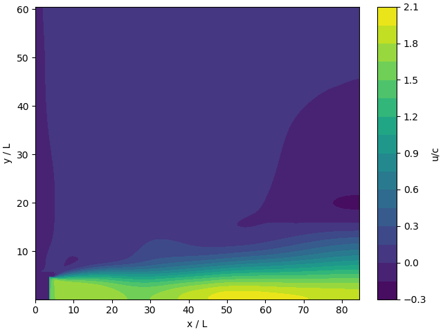
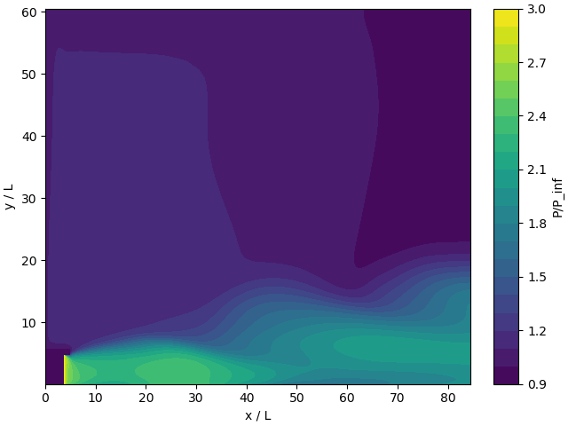
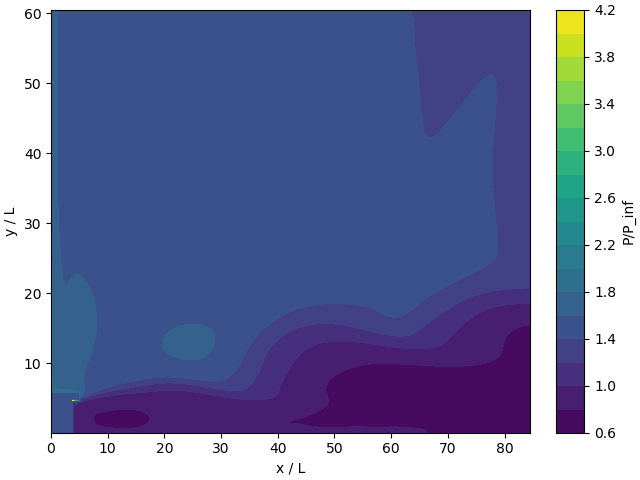

## Problem

We are going to find a numerical solution for the Navier-Stokes equations for an axisymmetric nozzle. To do this, we will use use macCormacks´s explicit finite differences algorithm, an adaptative rectangular grid as the mesh, and locally dependant eddy viscosity model. First, I´m going to expose the general problem and then I´m going to solve it on a GPU to improve the performance.

### Initial conditions

For simplicity, the initial conditions of the external flow are going to be a subsonic flow with M = 0, P = 101325, T_inf = 288.16. 

### Boundary Conditions

The integration domain is going to be the same used in [1]:

So we need to define the boundary conditions in this domain:

#### Upstream Boundary

The inflow conditions of the upstream external flow will be the same as those defined in the initial conditions.

### Outer and Downstream Boundary

We are going to model the outer and downstream boundary similarly, using an extrapolation method, as we are assuming that they are far away of the nozzle flow. In the case of the downstream boundary, this is not necessaruly true, but using a Second order Taylor series expansion for supersonic flow on the boundary gives good results.

$$ f_B = 3f_{B-1} - 3f_{B-2} + f_{B-3}$$

where f denotes the primitive flow variables, $\rho$, u, v, and T; and B denotes the boundary coordinates, so on the downstream boundary $B-1 = (i-1, j)$ at the boundary.

To obtain the formula above we can use the Tyalor series expansion to second order, using left-sided finite differences schemes:

$${\Delta x }$$
$$ u_{t+1, i} = u_{t, i} + \Delta x \left(\frac{\partial u}{\partial x} \right)_i + \frac{ { \Delta x}^2}{2} \left(\frac{\partial^2 u}{\partial x^2} \right)_i + O({\Delta x}^3)$$

And to mantain the second order, the first derivative needs to be expanded with a second order scheme:

$$ \left(\frac{\partial u}{\partial x} \right)_i = \frac{3u_i - 4u_{i-1} + u_{i-2}}{2 \Delta x}$$ 

And we can use a first order scheme with the second derivative:

$$ \left(\frac{\partial^2 u}{\partial x^2} \right)_i = \frac{u_i - 2u_{i-1} + u_{i-2}}{ \Delta x^2}$$ 

And substituting in the above equation, we obtain the equation to use in the boundary.

### Axis Boundary

The axis or centerline boundary is a line of symmetry with no mass or energy flux across it. 
The normal velocity component is set to zero:

$$v_{i, 0} = 0$$

For the density and velicity u, we will use the Second order Taylor series expansion again, that combined with the symmetry condition gives.

$$ f_{i, 0} = \frac{4f_{i, 1} - f_{i, 2}}{3}$$

The symmetru condition implies that $f_{i, -1} = f_{i, 1}$

To obtain the temperature, we can use the fact that this line is a streamline, so the we can apply a constant stagnation enthalpy condition with:

$$ (C_P T + u^2/2) = constant$$

### Nozzle Walls

The nozzle walls will have the no-slip condition, so the velocity will be zero.
The temperature will be equal to the wall temperature.

And to find the pressure, we can use a first order zero pressure gradient condition:

$$ \frac{\partial P}{\partial n} = 0$$

where n is normal to the wall.

### Mesh

For the mesh, we are going to use a rectangular grid with non-constant x and y steps. the reason for this, is that we want a finer mess near the nozzle exit and the wall, and to better handle the outer and downstream boundaries, we would like for them to be far away.
So the size of the grid cells are going to be small in a zone of 2 * nozzle radius and 2 * nozzle wall width. And then the cell size will increase linearly to 10 * delta, where delta is the smallest grid size in each dimension.

The length of the horizontal domain is an input, where I have used 20 meters, wich will be normalized before the calculation of the grid size.

For the vertical domain, I have used the Reynolds number to predict an appropiate size:

$$ L_y = 5L_x / Re$$

### Time Step

To calculate the time step, we find the maximum allowable time step  in the x and y direction given by the Courant-Friedrichs-Lewy (CFL) limit, for every point. And then take the minimum for every point in both directions. And then we can multiply this by a safety facor, I used 0.6.

$$ \Delta t_x = \frac{\Delta S_x}{|u_x| + c + \frac{1}{\rho}  (\frac{2 \gamma}{\Delta_y}(\frac{\mu}{Pr} + \frac{\epsilon}{Pr_t}) + \frac{1}{\Delta_y}[-(\lambda + \lambda_t)(\mu + \epsilon)]^0.5)}$$

And a similar equation for the y direction. $\Delta S_x$ is the grid cell length in the x direction.

## Using GPU

To reduce the execution time of the program, most part of the algorithm can use CUDA to be run on the GPU. 

The enviroment I have been using is Visual Studio, and there are a lot of information on how to install CUDA C on VS.

## Arrays on GPU Device

To start the implementation of the algorithm with CUDA, let´s focus on the arrays. We use a lot of arrays to store information such as the density, velocity, pressure, ... But also as containers to pass information between the functions. In the CPU versions, these arrays used in general STD::vector as the data structure. Unfortunately, we can´t use STD in CUDA, there are some alternatives, but because implementing arrays and vectors is not so difficult, we are going to implement our own simple class. With this we can get some simplicity, but they are going to be really simple implementations, and not much thought has gone in how to make them general and handle all possible situations.

In order for an object to be used in CUDA, we need to allocate the memory in the device. We can use cudaMalloc for this, but for a dynamic array we will encounter something like this:


template<class T>
class SimpleVector {
    ...
private:
    size_t size_;
    T* data_;
}


So if we allocate an object as follows:


SimpleVector<T>* simple_vector;
cudaMalloc((void**)&simple_vector, sizeof(SimpleVector<T>));


We can not allocate memory for the data from the host, so we need to call a function in the device to allocate the memory. I have decided to do something like:



template <class T>
__device__ SimpleVector<T>::SimpleVector(int n) {
    data_ = new T[n];
    memset(data_, T(), n);
    size_ = n;
}

template <class T>
__device__ Array2DGpu<T>::~Array2DGpu() {
    delete data_;
}

template <class T>
__global__ void initSimpleVector(void* data, int n)
{
    if (threadIdx.x == 0 && blockIdx.x == 0) {
        new (data) SimpleVector<T>(n);
    }
}

template <class T>
__global__ void destroySimpleVector(SimpleVector<T>* buf)
{
    if (threadIdx.x == 0 && blockIdx.x == 0) {
        buf->~SimpleVector<T>();
    }
}

SimpleVector<double>* CreateInHost(int n) {
    SimpleVector<double>* simple_vector;
    cudaMalloc((void**)&simple_vector, sizeof(SimpleVector<double>));
    initSimpleVector<double> << <1, 1 >> > ((void*)simple_vector, n);
    return simple_vector;
}


We can see the the object is created and destroyed inside the device, the pointer to the object is stored in the host, but the memory of the object is allocated in the device, so ww will have to free at the end with cudaFree.

One of the benefits of doing it like this, it´s that we will not have to copy the memory from the host to the device and vice versa on each time step, but the problem is the it´s harder to debug, as we can read the memory of the device from the host. Nsight in VS for CUDA debugging provides some of this functionality, but it´s harder to use than the C++ debugger on VS.

### Implement Algorithm in GPU

The file structure that I have used is usually a .h header file and two source files, a .cpp and a .cu. Probably it would have been enough to use only the .cu, but for some functions, it was more appropiate to define the body in the cpp.  
Then, in the algorithm, most of the transformation from CPU to GPU implied moving the body of the functions to a global function on the device, with the logic of the function, and calling this function from the older one. 
Here I have implemented a simple function that copies data from one object to another in the device.


    __global__ void f_device(int n, const SimpleVector<double>* in, SimpleVector<double>* out) {

        unsigned int tid = threadIdx.x;
        unsigned int idx = blockIdx.x * blockDim.x + threadIdx.x;
        unsigned int gridSize = blockDim.x * gridDim.x;

        while (idx < n) {
            *(out + idx) = *(in + idx);

            idx += gridSize;
        }
    }

    void f((int n, const SimpleVector<double>* in, SimpleVector<double>* out) {
        f_device<<<num_blocks, num_threads, 1>>>f_device(n, in, out);
    }



We can see the syntax to call a function on the device, we need to define the number of blocks and threads per block. This should depend on the GPU, I have used 32/64 blocks and 256 threads per block.

With this, it´s not hard to code all the previous functionality in CUDA. There are probably sme compiler and linker errors along the way, and maybe some exception for accessing NULL pointers which can be debugged with Nsight.

### Find Minimum Time Step

There one thing that needs to be explained with more detail. We need to find the minimum of the time steps for every grid cell, and also check the convergence condition for every cell. The usual algorithm for finding the minimum of an array is to iterate over all the array, and find the min of all elements. This doesn´t work with CUDA, because we only have access to a few elements of the array, and even using shared memory, we can only share memory inside the block, but not between the blocks, because we can´t synchronize blocks.

The algorithm used is based on [2], where they use a two step approach, first we can find the minimum value for each block of threads, and then find the minimum of all the blocks.

First, we declare an array of global memory of size num_blocks, and a struct of shared memory. Then we use a O(nlogn) algorithm to find the minimum. First we find the minimum value for each thread in each block, then we can iterate, reducing the size by 2 on each step, by finding the minimum of two threads and synchronizing all threads.
In the end, we could find the minimum of all the blocks either on the device on a single block, or in the host by copying the memory from the device to the host.



// Utility class used to avoid linker errors with extern
// unsized shared memory arrays with templated type
template<class T>
struct SharedMemory {
    __device__ inline operator T *() {
        extern __shared__ int __smem[];
        return (T *)__smem;
    }

    __device__ inline operator const T *() const {
        extern __shared__ int __smem[];
        return (T *)__smem;
    }
};

// specialize for double to avoid unaligned memory
// access compile errors
template<>
struct SharedMemory<double> {
    __device__ inline operator double *() {
        extern __shared__ double __smem_d[];
        return (double *)__smem_d;
    }

    __device__ inline operator const double *() const {
        extern __shared__ double __smem_d[];
        return (double *)__smem_d;
    }
};

template<class T, unsigned int blockSize2>
__global__ void reduceMin6(T *g_odata, unsigned int n, const Array2DGpu<double>* data) {
    T *sdata = SharedMemory<T>();

    // perform first level of reduction,
    // reading from global memory, writing to shared memory
    unsigned int tid = threadIdx.x;
    unsigned int idx = blockIdx.x * blockSize * 2 + threadIdx.x;
    unsigned int gridSize = blockSize * 2 * gridDim.x;

    T myMin = 99999;

    while (idx < n) {
        myMin = MIN(data->Get(idx), myMin);

        if (idx + blockSize < n) {
            myMin = MIN(data->Get(idx + blockSize), myMin);
        }

        idx += gridSize;
    }

    // each thread puts its local sum into shared memory
    sdata[tid] = myMin;
    __syncthreads();

    // do reduction in shared mem
    if ((blockSize >= 512) && (tid < 256)) {
        sdata[tid] = myMin = MIN(sdata[tid + 256], myMin);
    }

    __syncthreads();

    if ((blockSize >= 256) && (tid < 128)) {
        sdata[tid] = myMin = MIN(sdata[tid + 128], myMin);
    }

    __syncthreads();

    if ((blockSize >= 128) && (tid < 64)) {
        sdata[tid] = myMin = MIN(sdata[tid + 64], myMin);
    }

    __syncthreads();

    // fully unroll reduction within a single warp
    if ((blockSize >= 64) && (tid < 32))
    {
        sdata[tid] = myMin = MIN(sdata[tid + 32], myMin);
    }

    __syncthreads();

    if ((blockSize >= 32) && (tid < 16))
    {
        sdata[tid] = myMin = MIN(sdata[tid + 16], myMin);
    }

    __syncthreads();

    if ((blockSize >= 16) && (tid < 8))
    {
        sdata[tid] = myMin = MIN(sdata[tid + 8], myMin);
    }

    __syncthreads();

    if ((blockSize >= 8) && (tid < 4))
    {
        sdata[tid] = myMin = MIN(sdata[tid + 4], myMin);
    }

    __syncthreads();

    if ((blockSize >= 4) && (tid < 2))
    {
        sdata[tid] = myMin = MIN(sdata[tid + 2], myMin);
    }

    __syncthreads();

    if ((blockSize >= 2) && (tid < 1))
    {
        sdata[tid] = myMin = MIN(sdata[tid + 1], myMin);
    }

    __syncthreads();
    // write result for this block to global mem
    if (tid == 0) {
        g_odata[blockIdx.x] = myMin;
    }
}

////////////////////////////////////////////////////////////////////////////////
template<class T>
void reduceMin(int size, int threads, int blocks, int whichKernel, const Array2DGpu<double>* data, T *d_odata) {
    dim3 dimBlock(threads, 1, 1);
    dim3 dimGrid(blocks, 1, 1);

    // when there is only one warp per block, we need to allocate two warps
    // worth of shared memory so that we don't index shared memory out of bounds
    int smemSize =
        (threads <= 32) ? 2 * threads * sizeof(T) : threads * sizeof(T);

    switch (threads) {
    case 512:
        reduceMin6<T, 512> << <dimGrid, dimBlock, smemSize >> > (d_odata,
            size, data);
        break;
    }
    ...
}

__global__ void getMin(double* arr, int n, double* val) {
    int idx = threadIdx.x;
    for (int i = n / 2; i > 0; i >>= 1) {
        if (idx < i) {
            arr[idx] = MIN(arr[idx], arr[idx + i]);
            __syncthreads();
        }
    }

    if (idx == 0) {
        *val = arr[0];
    }
}

void ArrayMin::reduceArrayMin(int threads, int blocks, int whichKernel, double* val) {

    reduceMin(n, threads, blocks, whichKernel, data_, delta_t_per_block);

    getMin << <1, blocks / 2, 1 >> > (delta_t_per_block, blocks, val);

}



(Array2DGpu is the I used for the SimpleVector defined earlier)

All this functionality is contained in a class that is shared, so we don´t have to create and destroy the data for each use. data_ is a structure that contains the data for which we want to find the minimum. So to use this function, we first need to copy the our data to data_.

### Performance Results

| Time Steps        | CPU           | GPU  |
| ------------- |:-------------:| -----:|
| 10      | 46 ms | 500 ms |
| 100      | 298 ms      |   560 ms |
| 1000 | 3242 ms   |    1250 ms |

Grid 80x80

| Time Steps        | CPU           | GPU  |
| ------------- |:-------------:| -----:|
| 10      | 1607 ms | 1531 ms |
| 100      | 12798 ms   |   15995 ms |
| 1000 | 127308 ms  |    23910 ms |

Grid 1000x250

More than 10 times faster, 1500000 iterations, almost 3 hours.

## Results

## References
[1] Navier-Stokes Solutions for an Axisymmetric Nozzle, Hasen, 1981
[2] Finding Minimum Value in Array, https://stackoverflow.com/questions/38176136/finding-minimum-value-in-array-and-its-index-using-cuda-shfl-down-function
[3] CUDA C Programming Guide, https://docs.nvidia.com/cuda/cuda-c-programming-guide/index.html#heap-memory-allocation
[4] A Numerical Method For Solving The Navier-Stokes Equations with Application to Shock-Boundary Layer Interactions, MacCormack and Baldwin, 1975
