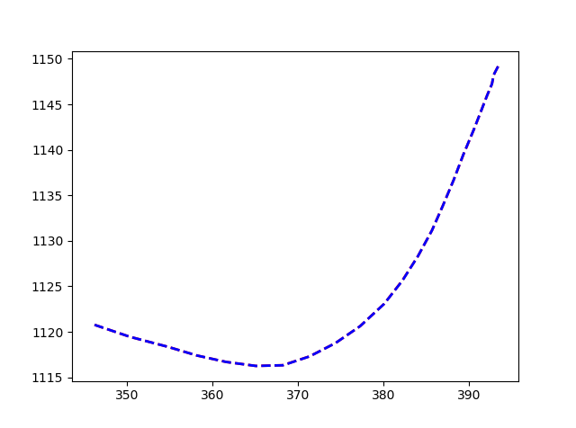

## Introduction

## Linear Kalman Filter

$$ \bar{x} = Fx + Bu$$
$$ \bar{P} = FPF^T + Q$$

F is the state transition matrix , which is used to transition the state´s values between discrete time steps.

Q is the process noise matrix, and in general, the design of the Q matrix is among the most difficult aspects of Kalman filter design. If Q is too small then the filter will be overconfident in its predicitons, and it will be diverge from the actual solution. But if Q is too large the filter will be influenced by the noise in the measurements too much and it will perform sub-optimally. In general, we could use a continuous white noise model. 
We can also use a simpler form of Q, if we make the assumption that Q is small compared to P, and we can set it to zero except a $\sigma^2$ term.

$$y = z - H\bar{x}$$
$$K = \bar{P}H^T(H\bar{P}H^T + R)^{-1}$$
$$x = \bar{x} + Ky$$
$$P = (I - KH)\bar{P}$$

## Extended Kalman Filter

We are considering a nonlinear model described as:

$$ X_k = f(X_{k-1}, W_k)$$
$$ Y_k = h(X_k) + V_k$$

where $W_k\sim \mathcal{N}(0, Q_w)$, $V_k\sim \mathcal{N}(0, Q_v)$ are mutually independent and f and h are nonlinear functions. For the EKF we use a first order Taylor expansion of the nonlinear functions around the current estimation $\hat{X}_{k-1}$ and around the mean $E[W_k] = 0$ of the state noise, so we get the approximation:

$$ X_k \simeq \bar{X}_k = f(\hat{X}_{k-1}, 0) + F_k(X_{k-1} - \hat{X}_{k-1}) + G_kW_k$$

where,

$$ F_k = \frac{\partial f}{\partial X_{k-1}}(\hat{X}_{k-1}, 0)$$

and 

$$ G_k = \frac{\partial f}{\partial W_{k}}(\hat{X}_{k-1}, 0)$$

The prediction step for the discrete EKF is then,

$$ \hat{X}_k = f(\hat{X}_{k-1}, 0)$$

$$ \bar{P}_k = F_kP_{k-1}F^T_{k} + G_kQ_WG^T_k$$

The correction step is:

$$ K_k = \bar{P}_kH^T_k(H_k \bar{P}_kH^T_k+Q_v)^{-1}$$
$$ X = \hat{X} + K_k(Y_k - h(\hat{X}_k))$$
$$ P_k = \bar{P}_k - K_k H_k \bar{P}_k$$

where $H_k$ is the linearization of the observation function around the prediction:

$$ H_k = \frac{\partial h}{\partial X_k}(\hat{X}_k)$$

## State Transition Function

The state transition function is implemented as a matric F which we multiply the previous state to obtain the next state.

$$ x_{n+1} = Fx_{n} $$

In 1D, the transition matrix F can be obtained from the following relation.

$$ x_{n+1} = x_{n} + \delta t * \cdot{x_{n}} $$

```c++
dt = 0.1
F = [[1.0 dt 0.0 0.0]; [0.0 1.0 0.0 0.0]; 
     [0.0 0.0 1.0 dt]; [0.0 0.0 0.0 1.0]]
```

## Process Noise Matrix
We assume that the noise is a discrete time Wiener process, that is, it is constant for each time period.

```c++
var = 0.001
Q = [[.0 var 0.0 0.0]; [var var 0.0 0.0]; 
     [0.0 0.0 .0 var]; [0.0 0.0 var var]]
```

## Measurement Function
The measurement function tell us how to get the measurements from the state variable. We can use the position as the measurement, so in this case in the equation

$$z=Hx$$

```c++
H = [[1.0 0.0 0.0]; 
     [0.0 0.0 1.0 0.0]]
```
## Measurement Noise Matrix
We assume that the x and y variables are independent white Gaussian processes.

```c++
R = [[5.0 0.0]; 
     [0.0 5.0]]
```

## Models

We are going to use three models with the same state vector $X = (x, y, \theta, s, \dot{\theta}, \dot{s})^T$. The measurement model is $Z=(x, y, \theta)^T$, and the measurement equation is the same for all models $Z = HX + w$, where H is the measurement matrix and w is the measurement error vector. The state transition functions are obtained by integrating the following stochastic differential equations over time.

### Model 1. The constant velocity Model (CV)

$$ \dot{X} = 
\begin{bmatrix} 
s\cos{\theta} \\
s\sin{\theta} \\
0 \\
0 \\
0 \\
0
\end{bmatrix} +
\begin{bmatrix} 
0 \\
0 \\
e_{\dot{\theta}} \\
e_{\dot{s}} \\
0 \\
0
\end{bmatrix} $$

$e_{\dot{\theta}}$ and $e_{\dot{s}}$ are gaussian white noise term to absorb the error made by using the constant velocity assumption.

As we have seen previously, from these differential equations, we can obtain the function $f$ to solve the state transition: $X_n = f(X_{n-1})$. And we get the state transition matrix F with the jacobian of $f$. For this model, the matrix F is:

$$ F = 
\begin{bmatrix} 
0 & 0 & -s\Delta t\sin{\theta} & \Delta t\cos{\theta} & 0 & 0\\
0 & 0 & s\Delta t\cos{\theta} & \Delta t\sin{\theta} & 0 & 0\\
0 & 0 & 0 & 0 & 0 & 0\\
0 & 0 & 0 & 0 & 0 & 0\\
0 & 0 & 0 & 0 & 0 & 0\\
0 & 0 & 0 & 0 & 0 & 0
\end{bmatrix}
$$

Also, we need to find the matrix V by finding the jacobian in the control space. In this model the control variables are $s$ and $\theta$.

$$ V = 
\begin{bmatrix} 
-s\Delta t\sin{\theta} & \Delta t\cos{\theta}\\
s\Delta t\cos{\theta} & \Delta t\sin{\theta}\\
0 & 0\\
0 & 0\\
0 & 0\\
0 & 0
\end{bmatrix}
$$

### Model 2. The Constant Acceleration Model (CA)

$$ \dot{X} = 
\begin{bmatrix} 
(s + \dot{s}t)\cos{\theta} \\
(s + \dot{s}t)\sin{\theta} \\
0 \\
\dot{s} \\
0 \\
0
\end{bmatrix} +
\begin{bmatrix} 
0 \\
0 \\
e_{\dot{\theta}} \\
0 \\
0 \\
e_{\ddot{s}}
\end{bmatrix} $$

$e_{\dot{\theta}}$ and $e_{\ddot{s}}$ are gaussian white noise term to absorb the error made by using the constant acceleration assumption.

$$ F = 
\begin{bmatrix} 
0 & 0 & -(s\Delta t + \frac{1}{2}\Delta t^2\dot{s})\sin{\theta} & \Delta t\cos{\theta} & 0 & \frac{1}{2}\Delta t^2\sin{\theta}\\
0 & 0 & (s\Delta t + \frac{1}{2}\Delta t^2\dot{s})\Delta t\cos{\theta} & \Delta t\sin{\theta} & 0 & \frac{1}{2}\Delta t^2\cos{\theta}\\
0 & 0 & 0 & 0 & 0 & 0\\
0 & 0 & 0 & 0 & 0 & \Delta t\\
0 & 0 & 0 & 0 & 0 & 0\\
0 & 0 & 0 & 0 & 0 & 0
\end{bmatrix}
$$

$$ V = 
\begin{bmatrix} 
-(s\Delta t + \frac{1}{2}\Delta t^2\dot{s})\sin{\theta} & \frac{1}{2}\Delta t^2\sin{\theta}\\
(s\Delta t + \frac{1}{2}\Delta t^2\dot{s})\cos{\theta} & \frac{1}{2}\Delta t^2\cos{\theta}\\
0 & 0\\
0 & \Delta t\\
0 & 0\\
0 & 0
\end{bmatrix}
$$

### Model 3. The Turning Model (T)


$$ \dot{X} = 
\begin{bmatrix} 
(s + \dot{s}t)\cos{(\theta 
 +\dot{\theta}t)} \\
(s + \dot{s}t)\sin{(\theta 
 +\dot{\theta}t)} \\
\dot{\theta} \\
\dot{s} \\
0 \\
0
\end{bmatrix} +
\begin{bmatrix} 
0 \\
0 \\
0 \\
0 \\
e_{\ddot{\theta}} \\
e_{\ddot{s}}
\end{bmatrix} $$

$e_{\ddot{\theta}}$ and $e_{\ddot{s}}$ are the noise terms used to account for jerk and angular acceleration.

$$ F = 
\begin{bmatrix} 
0 & 0 & -(s\Delta t + \frac{1}{2}\Delta t^2\dot{s})\sin{(\theta 
 + \Delta t \dot{\theta})} & \Delta t\cos{(\theta 
 + \Delta t \dot{\theta})} & -\Delta t(s\Delta t + \frac{1}{2}\Delta t^2\dot{s})\sin{(\theta 
 + \Delta t \dot{\theta})} & \frac{1}{2}\Delta t^2\sin{(\theta 
 + \Delta t \dot{\theta})}\\
0 & 0 & (s\Delta t + \frac{1}{2}\Delta t^2\dot{s})\Delta t\cos{(\theta 
 + \Delta t \dot{\theta})} & \Delta t\sin{(\theta 
 + \Delta t \dot{\theta})} & \Delta t(s\Delta t + \frac{1}{2}\Delta t^2\dot{s})\cos{(\theta 
 + \Delta t \dot{\theta})} & \frac{1}{2}\Delta t^2\cos{(\theta 
 + \Delta t \dot{\theta})}\\
0 & 0 & 0 & 0 & \Delta t & 0\\
0 & 0 & 0 & 0 & 0 & \Delta t\\
0 & 0 & 0 & 0 & 0 & 0\\
0 & 0 & 0 & 0 & 0 & 0
\end{bmatrix}
$$

$$ V = 
\begin{bmatrix} 
-\Delta t(s\Delta t + \frac{1}{2}\Delta t^2\dot{s})\sin{(\theta 
 + \Delta t \dot{\theta})} & \frac{1}{2}\Delta t^2\sin{(\theta 
 + \Delta t \dot{\theta})}\\
\Delta t(s\Delta t + \frac{1}{2}\Delta t^2\dot{s})\cos{(\theta 
 + \Delta t \dot{\theta})} & \frac{1}{2}\Delta t^2\cos{(\theta 
 + \Delta t \dot{\theta})}\\
\Delta t & 0\\
0 & \Delta t\\
0 & 0\\
0 & 0
\end{bmatrix}
$$

## Extended Interacting Multiple Models

The IMM algorithm is a useful algorithm for managing multiple models for tracking maneuvering targets, it provides good estimates and is real time. We extend the IMM algorithm to provide qualitative motion analysis.
$\hat{X}_k^j$ is the state estimate at time step k based on model j, $\Lambda_k$ is the vector of model likelihoods at time k, $\hat{X}_k$ is the state combined from all model estimates and $\mu_k$ is the vector of the model probabilites at time k when all the likelihoods have been considered.

The EIMM algorithm is:

#### Step 1: Mixing of State Estimates

We start the a priori state estimates $\hat{X}_{k-1}^i$ to compute the mixed state estimates and the mixed state error covariance:

$$ \hat{X}_{k-1}^{0j} = \sum_{i=1}^N{\hat{X}_{k-1}^iJ_{k-1}(ij)}$$

where 

$$J_{k-1}(ij)=p_{ij}\mu_{k-1}^i/\bar{c}_j$$

$$\bar{c}_j = \sum_{i=1}^N{p_{ij}\mu_{k-1}^i}$$

where $p_{ij}$ is the transition probability for switching from model i to model j. Here we assume a uniform distribution for all models.

$$ P_{k-1}^{0j} = \sum_{i=1}^N{[P_{k-1}^i + (\hat{X}_{k-1}^i  - \hat{X}_{k-1}^{0j})(\hat{X}_{k-1}^i  - \hat{X}_{k-1}^{0j})^T]J_{k-1}(ij)}$$

```julia
n_models = 3
for j = 1:n_models
     c[j] = 0
     for i = 1:n_models
          c[j] += p[i, j]*mu[i]
     end
end

for i = 1:n_models
     for j = 1:n_models
          J[i, j] = p[i, j]*mu[i]/c[j]
     end
end

for j = 1:n_models
     for i = 1:n_models
          X_j[j, :] += X[1, :]*J[i, j]
     end
end

for j = 1:n_models
     for i = 1:n_models
          P_j[j, :, :] += (P[i, :, :] + (X[i, :] - X_j[j, :]) *
          transpose((X[i, :] - X_j[j, :])))*J[i, j]
     end
end
```

#### Step 2: Model State Updates
 The model updates are solved using EKFs (Extended Kalman Filters). The values of $\hat{X}_{k-1}^{0j}$ and $P_{k-1}^{0j}$ are used as input to the EKF matched to model j to obtain $\hat{X}_{k}^{j}$ and $P_{k}^{j}$.

 ```julia
for k = 1:n_models
     X[k, :] = X_j[k, :]
     P[k, :, :] = P_j[k, :, :]

     s = X[k, 4]
     theta = X[k, 3]
     ds = X[k, 6]
     dtheta = X[k, 5]
     dt = 0.1

     # Calculate matrices F, V and M for the model.

     # EKF algorithm
     Q[k, :, :] = V[k, :, :]*M[k, :, :]*transpose(V[k, :, :])

     x = X[k, :]

     x_bar = F[k, :, :] * x
     P_bar = F[k, :, :]*P[k, :, :]*transpose(F[k, :, :]) + Q[k, :, :]
     y[k, :] = z - H*x_bar
     K = P_bar*transpose(H)*inv(H*P_bar*transpose(H) + R)

     x = x_bar + K*y[k, :]
     P[k, :, :] = (I - K*H)*P_bar

     X[k, :] = x[:]

     P[k, :, :] = H*P_bar*transpose(H) + R
end
  ```

#### Step 3: Model Likelihood Computations

Model Likelihood Computations are based on the filter residuals, $\bar{Z}_k = z_{k} - H\hat{X}_{k-1}$, the covariance of the filter residuals, $T_k = H{P}_{k-1}H^T + R$, and the assumption of Gaussian statistics.

$$\Lambda_k^j = \frac{1}{\sqrt{|2\pi T_k^j|}}exp(-0.5(\bar{Z}_k^j)^T(T_k^j)^{-1}\bar{Z}_k^j)$$

```julia
P_res = H*P_bar*transpose(H) + R
y[k, :] = z - H*x_bar
lambda[k] = 1.0 / sqrt(2*acos(-1.0)*det(P_res))*
                exp(-0.5*transpose(y[k, :])*inv(P_res)*y[k, :])
```

#### Step 4: Model Probabilites Update
The model probabilities are updated according to
model likelihoods and the model switching matrix governed by the Markov chain

$$ \mu_k(j)=\frac{\Lambda_k^j\bar{c}_j}{\sum_{i=1}^N\Lambda_k^i\bar{c}_i}$$

```julia
sum = 0
for i = 1:3
     sum += lambda[i]*c[i]
end
for j = 1:n_models
     mu[j] = lambda[j]*c[j] / sum
end
```
#### Step 5: Quantitative Motion Estimates

$$ \hat{X}_k = \sum_{i=1}^N{\bar{X}_k^i\mu_k^i}$$

$$ P_k = \sum_{i=1}^N{\mu_k^i[P_{k}^i + (\hat{X}_{k}^i  - \hat{X}_{k})(\hat{X}_{k}^i  - \hat{X}_{k})^T]}$$

```julia
Xf = zeros(6)
Pf = zeros(6, 6)
for i = 1:3
     Xf += X[i, :]*mu[i]
     Pf += mu[i]*(P[i, :, :] + (X[i, :] - Xf)*transpose(X[i, :] - Xf))
end
```

## Results

We have used the nuScene dataset (https://www.nuscenes.org/) to get trajectories of cars to test this algorithm. We have taken some random trajectories of cars with pose information, translation and orientation.




## References

[1] Paul Frogerais, Jean-Jacques Bellanger, Lotfi Senhadji. Various Ways to Compute the ContinuousDiscrete Extended Kalman Filter. IEEE Transactions on Automatic Control, Institute of Electrical
and Electronics Engineers, 2012, 57 (4), pp.1000 - 1004. ff10.1109/TAC.2011.2168129ff. ffhal-00904376

[2] Liang Zhao, C. Thorpe. Qualitative and quantitative car tracking from a range image sequence. Proceedings. 1998 IEEE Computer Society Conference on Computer Vision and Pattern Recognition (Cat. No.98CB36231).

[3] Józef Korbicz, Marcin Witczak. Design of an unscented unknown input filter with interacting multiple model algorithm. 2011 19th Mediterranean Conference on Control & Automation (MED), 2011.